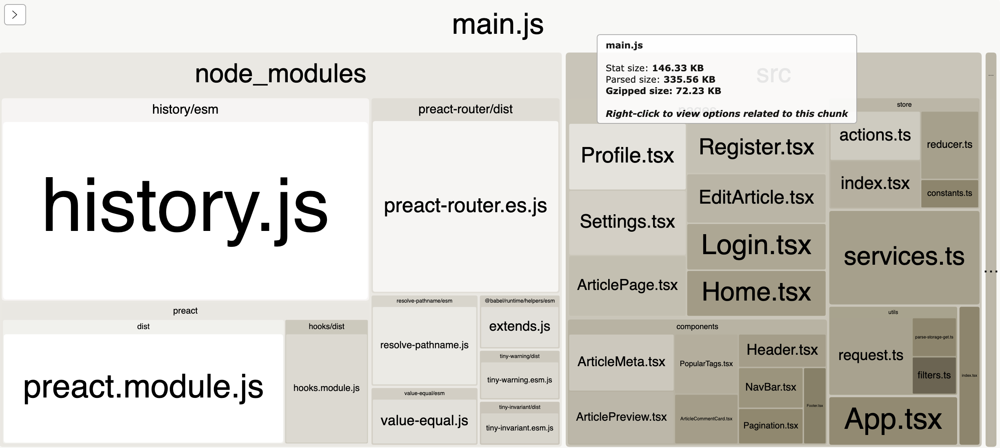
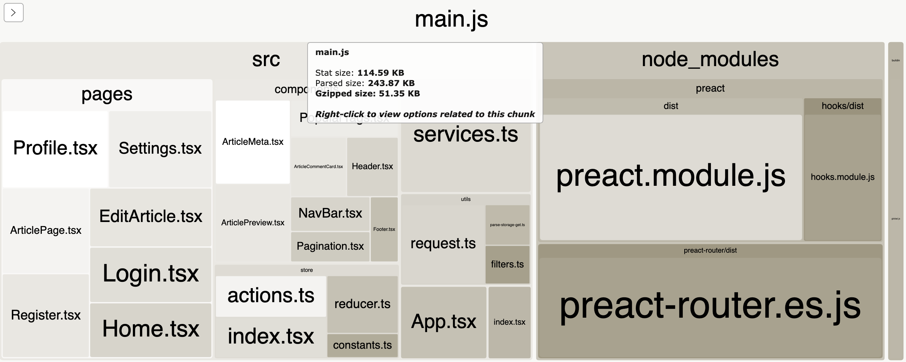

# 

[](https://github.com/mutoe/preact-realworld-example-app/actions)
[](https://coveralls.io/github/mutoe/preact-realworld-example-app?branch=master)

> Forked from [hassanbazzi/preact-realworld-example-app](https://github.com/hassanbazzi/preact-realworld-example-app)

> ### [Preact X](https://github.com/developit/preact) codebase containing real world examples (typescript, hooks, preact-router, fetch, etc) that adheres to the [RealWorld](https://github.com/gothinkster/realworld) spec and API.


### [Demo](https://github.com/gothinkster/realworld) [RealWorld](https://github.com/gothinkster/realworld)


This codebase was created to demonstrate a fully fledged fullstack application built with **[Preact]** including CRUD operations, authentication, routing, pagination, and more.

We've gone to great lengths to adhere to the **[Preact]** community styleguides & best practices.

For more information on how to this works with other frontends/backends, head over to the [RealWorld](https://github.com/gothinkster/realworld) repo.


# Getting started

```shell script
# install dependencies
yarn install

# start development
yarn start

# run tests (with coverage)
yarn test --coverage

# build
yarn build

# analyzer bundle size
yarn analyzer
```

# Bundle size



There is 72KB left after gzip for the whole project, It was larger than I expected because I didn't introduce redux/mobx, using preact hooks.

`history.js` is too big, I don't want it, but I have to use it to hash history.

I used `axios` before, and later I created a fetch tool myself to further reduce the packet size.

According to the [report](https://www.infoq.com/news/2019/04/real-world-framework-benchmark/), Preact isn't much ahead of React.

However, if `history.js` is removed, I think it can be compared with the data of Vue.

Here's what happens when you remove history.


